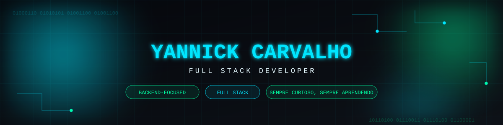

 

  
  
  

Me chamo **Yannick Carvalho**. Sou formado no curso profissional de **Redes e Sistemas Informáticos** e estou no último ano de **Engenharia Informática**.

Quero seguir como **Full Stack**, com foco futuro em **Backend** sem largar o Front — mas sou curioso por natureza, então não me limito a uma única linguagem ou área. Gosto de entender um pouco de tudo: da interface até a base de dados, passando por como a rede por trás disso tudo funciona.

- 🎯 QUerendo especializar em **Backend**, mantendo uma boa base em **Front-end**.
- 🔐 Interesse crescendo em **segurança de redes**
- 🌱 Aprendendo **C** no momento, e me aprofundando em **Java** e **JavaScript**.
- 🧠 Não gosto de escolher só uma linguagem — prefiro entender a estrutura e a base do ecossistema deles.

## `02.` Tecnologias e Frameworks

  

  

### Aprendendo agora

  

 Aprofundando: <b>Java</b> &amp; <b>JavaScript</b> &nbsp;•&nbsp;  Começando em: <b>C</b>

## `03.` 📊 Estatísticas do GitHub

<table align="center">
  <tr>
    <td align="center" colspan="2">
      
    </td>
    <ttr>
    <td align="center" colspan="2">
      
    </td>
  </tr>
  <tr>
        <td align="center" colspan="4">
      
    </td>
  </tr>
</table> 

<picture>
  <source media="(prefers-color-scheme: light)" srcset="https://raw.githubusercontent.com/Y-Carvalho/Y-Carvalho/output/github-contribution-grid-snake.svg" />
  
</picture>

>

## Projetos

  

  
  

